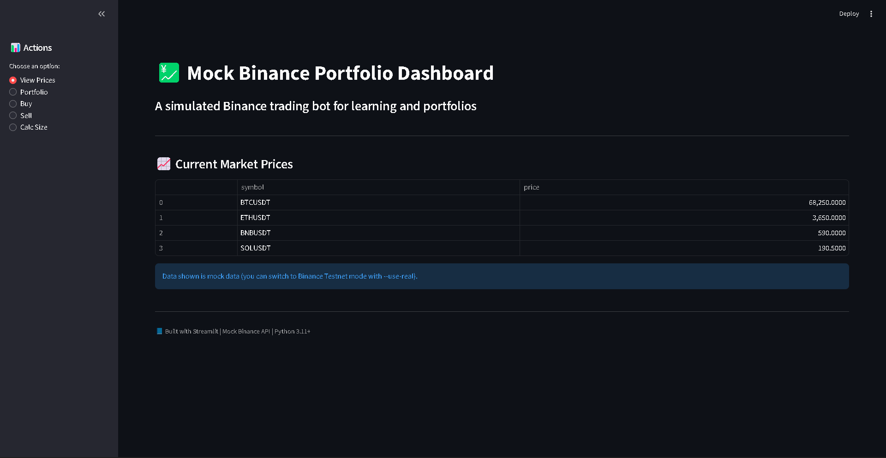
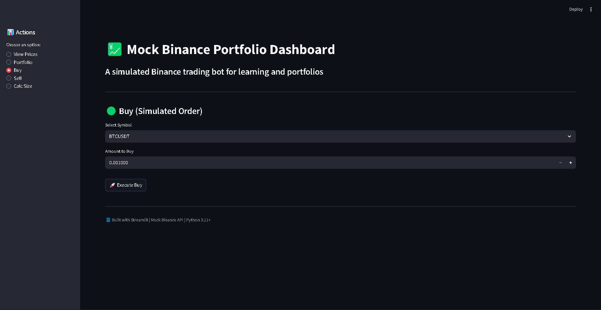
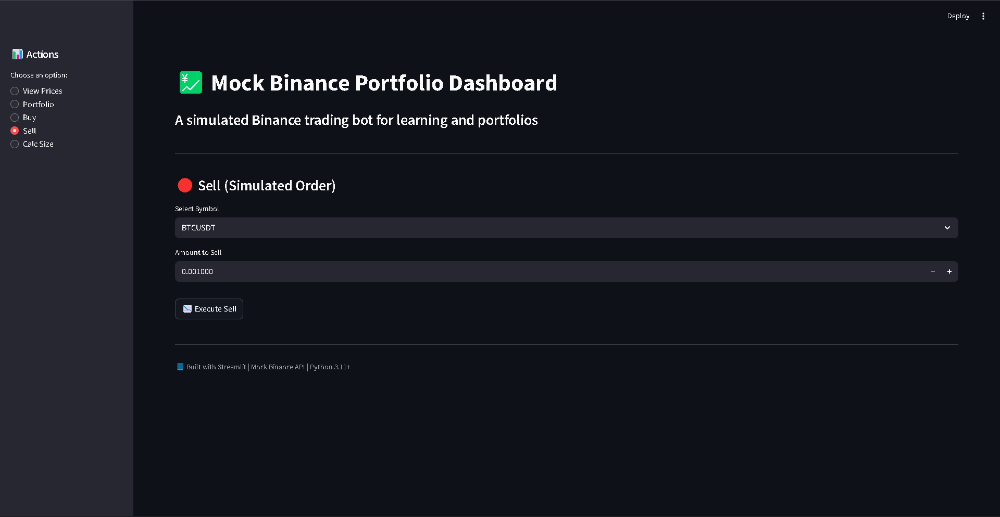

# 💹 Binance Portfolio Demo (CLI + GUI)  

🟢 **Live Mode** — Connect to Binance Testnet  
⚫ **Mock Mode** — Safe offline simulation  

A simulated **Binance trading bot** built with **Python** and **Streamlit**, designed for education, portfolio tracking, and demo trading.  
Run it fully offline in **Mock Mode**, or switch to **Real Mode** with your Binance Testnet API keys — all directly from the Streamlit sidebar.

<p align="center">
  
</p>

---

## 🚀 Features

### 🧠 Dual Mode Switching
- 🟢 **Real Mode:** Connect to Binance Testnet with your API keys.  
- ⚫ **Mock Mode:** Safe, offline simulation — no keys required.  
- Toggle between modes instantly in the GUI sidebar.

### 💻 CLI Trading Bot
- Simulated buy/sell, balance, and price queries  
- Risk-based position sizing (`calc-size`)  
- Optional Binance Testnet API integration  

### 🌐 Streamlit GUI
- Real-time mock or testnet prices  
- Interactive trade simulation  
- Portfolio visualization (pie chart)  
- Dark modern interface  
- Instant toggle between mock and real trading  

### 🔒 Safe & Offline
- Default mode uses **mock JSON data**  
- No Binance API connection needed  
- Real keys stored only in memory (session-based)

---

## 📂 Project Structure

```
binance-portfolio-demo/
├── data/
│   ├── mock_prices.json
│   └── mock_balance.json
├── assets/
│   ├── dashboard1.png
│   ├── dashboard2.png
│   └── dashboard3.png
├── trading_bot.py       # CLI bot (mock + optional real)
├── gui_app.py           # Streamlit GUI dashboard (mock + real switch)
├── requirements.txt
└── README.md
```

---

## ⚙️ Installation & Setup

### 1️⃣ Clone the Repository
```bash
git clone https://github.com/Donatusodoemenechinecheremchimobim/binance-portfolio-demo.git
cd binance-portfolio-demo
```

### 2️⃣ Create a Virtual Environment
```bash
python3 -m venv venv
source venv/bin/activate     # macOS/Linux
venv\Scripts\activate      # Windows
```

### 3️⃣ Install Requirements
```bash
pip install -r requirements.txt
```

If `requirements.txt` is missing:
```bash
pip install streamlit matplotlib
```

---

## ▶️ Usage

### 🧩 Run in Mock Mode (default)
```bash
# CLI examples
python trading_bot.py prices
python trading_bot.py balance
python trading_bot.py buy BTCUSDT 0.001

# GUI Dashboard
streamlit run gui_app.py
```
Mock mode uses local JSON data — no network or API keys needed.

---

### 🔑 Switch to Real Mode (Binance Testnet)

In the **Streamlit sidebar**, switch **“Mode” → “Real Mode”**.

Then:
1. Enter your **Testnet API Key** and **Secret**  
2. Click **Save API Keys**  
3. You’re now connected to the **Binance Testnet** — live data, no real funds!

> ⚠️ Always use Binance **Testnet** keys for demo purposes.  
> Never share or use live keys in public projects.

---

## 🧠 Example Commands (CLI)

```bash
python trading_bot.py prices
python trading_bot.py buy BTCUSDT 0.01
python trading_bot.py sell BTCUSDT 0.01
python trading_bot.py balance
python trading_bot.py calc-size BTCUSDT 1 0.01 2
```

---

## 🖼️ Screenshots

### Dashboard Overview
<p align="center"></p>

### Buy Simulation
<p align="center"></p>

### Portfolio View
<p align="center"></p>

---

## 💡 Troubleshooting

**🔹 “Python not found” error:**  
Ensure Python 3.11 is installed and added to PATH.

**🔹 PowerShell script error:**  
Run:
```bash
Set-ExecutionPolicy RemoteSigned
```
Then activate your environment.

**🔹 Streamlit install error:**  
Make sure you’re on Python 3.10 or 3.11:
```bash
pip install streamlit matplotlib
```

---

## 🧾 License

**MIT License © 2025 Donatus-ododemene Chinecherem Chimobim**

---

## 👤 Author

**Donatus-ododemene Chinecherem Chimobim**  
🔗 [GitHub Profile](https://github.com/Donatusodoemenechinecheremchimobim)

---

### 🌕 Summary

| Mode | Description | API Key Required | Risk |
|------|--------------|------------------|------|
| ⚫ **Mock Mode** | Safe local simulation | ❌ No | None |
| 🟢 **Real Mode** | Connects to Binance Testnet | ✅ Yes | Testnet Only |

> Switch between modes anytime in the sidebar — the dashboard updates instantly.
